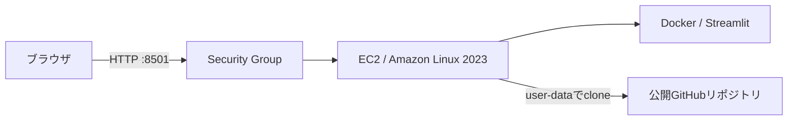

# 学生交流マッチング・シミュレータ

学校内の交流が学年や友人グループに偏る状況を、グラフ理論で単純化して比較する授業課題用Webアプリです。

**公開デモ：** [http://ec2-43-207-123-160.ap-northeast-1.compute.amazonaws.com:8501](http://ec2-43-207-123-160.ap-northeast-1.compute.amazonaws.com:8501)

> Elastic IPを使わないMVPのため、EC2を停止・再作成した場合はURLが変わります。

- 学生：頂点
- すでに話したことがある学生同士：無向辺
- まだ話したことがない2人：新しい交流の候補辺

同じ初期グラフから「ランダム方式」と「グラフ構造を利用した最大重みマッチング」を実行し、普段接点が生まれにくい学生同士へ、より多くの会話機会を作れるか比較します。扱うネットワークは架空モデルであり、実在する学生データではありません。

## デモで確認できること

Streamlit画面では次を確認できます。

1. 初期交流グラフ
2. 方法A（ランダム）の最終グラフ
3. 方法B（最大重みマッチング）の最終グラフ
4. 評価指標の比較
5. 各ラウンドの推移
6. 提案方式で各ペアが選ばれた理由
7. seedを変えた複数回実験の平均・標準偏差
8. ラウンド指標、マッチング、実験集計のCSV出力

## 問題設定と初期ネットワーク

基本設定は40人、4学年、各学年10人、各学年2友人グループ、1グループ5人です。人数が割り切れない設定では、学年と友人グループへできるだけ均等に割り当てます。

各学生は次の属性を持ちます。

| 属性 | 内容 |
|---|---|
| `student_id` | `S001` のような学生ID |
| `grade` | 学年 |
| `friend_group` | その学年内の友人グループ |

学生ペアごとに独立に初期辺を生成します。

| プリセット | 同学年・同グループ | 同学年・別グループ | 異学年 |
|---|---:|---:|---:|
| 分断が強い | 0.70 | 0.15 | 0.01 |
| 標準 | 0.60 | 0.20 | 0.05 |
| 分断が弱い | 0.50 | 0.25 | 0.15 |

各確率、学生数、学年数、グループ数、seedはサイドバーで変更できます。

## 交流候補とマッチング制約

ラウンド開始時点の交流グラフを \(G_t=(V,E_t)\) とします。自己ループと既存辺を除き、まだ話したことがない2人だけを候補にします。

- 1人が同一ラウンドで入れるペアは高々1つ
- まずマッチングサイズを最大化し、可能な限り多くの学生を組ませる
- 選ばれたペアを新しい交流辺として追加し、次ラウンドへ進む

## 方法A：ランダム方式

各候補辺にseed付き疑似乱数の重みを与え、`max_weight_matching(..., maxcardinality=True)` を実行します。これにより、まず最大人数を確保し、その制約内でランダムなペアを選びます。

この方法は再現可能ですが、「可能な最大マッチングすべてから厳密な一様分布で抽選する」アルゴリズムではありません。

## 方法B：最大重みマッチング

候補 \((u,v)\) を次の順で評価します。

1. \(C(u,v)\)：異なる連結成分なら1、同じなら0
2. \(d(u,v)\)：同じ連結成分内の最短経路距離。異なる成分なら0
3. \(Y(u,v)\)：異学年なら1、同学年なら0

学生数を \(n\)、最大ペア数を \(m=\lfloor n/2\rfloor\)、\(D_{max}=n-1\) として、

\[
B=m+1
\]

\[
A=mBD_{max}+m+1
\]

\[
w(u,v)=A C(u,v)+B d(u,v)+Y(u,v)
\]

とします。NetworkXの最大重みマッチングを `maxcardinality=True` で実行するため、最初にマッチングサイズが最大化されます。その最大サイズのマッチング間で、合計 \(C\)、合計距離、合計 \(Y\) の順に辞書式に最大化されます。

### なぜ `C > d > Y` が保証されるか

最大 \(m\) 本のペアに対して、\(Y\) の合計差は高々 \(m\) です。\(B=m+1\) なので、距離が1増える価値は、すべての \(Y\) の差より大きくなります。

距離と \(Y\) の合計が取り得る最大差は \(mBD_{max}+m\) です。\(A\) はそれより1大きいため、\(C\) が1増える価値は、それより下位の全評価差より大きくなります。感覚的な係数調整ではありません。

画面では、選択された各ペアについて次の表を表示します。

| student A | student B | C | distance | Y | weight |
|---|---|---:|---:|---:|---:|

## 評価指標

### 主指標

- **連結成分数**：小さいほどネットワーク全体の分断が少ない
- **異学年間新規辺割合**：その方式で追加した全辺に占める異学年間辺の累積割合

### 補助指標

- **最大連結成分割合**：最大連結成分の頂点数 ÷ 全学生数
- **グローバル効率**：全頂点ペアの距離の逆数平均。非連結ペアの寄与は0

初期状態をラウンド0として記録します。複数回実験では `base seed, base seed + 1, ...` と初期グラフを変え、最終値の平均と母標準偏差（`ddof=0`）を比較します。

## アルゴリズム上の限界

1ラウンド分のマッチングは、辺を追加する前の \(G_t\) を使って一括計算します。マッチング構築中にはグラフを更新しません。

そのため、たとえば同じ2連結成分の間から `A1-B1`, `A2-B2`, `A3-B3` が同時に選ばれることがあります。最初の1本で2成分が結合された後、残りの辺は連結成分数をさらに減らしません。

したがって、本方式が最大化する「異なる連結成分間の選択辺数」と「ラウンド後の連結成分数の減少」は一致しません。これは実装上のバグではなく、一括マッチング方式の限界です。

また、両方式は同じ初期グラフから始まり、各ラウンドでそれぞれ最大人数を組ませます。ただし1ラウンド目以降は追加辺が異なるため候補グラフも分岐し、後続ラウンドのペア数が異なる可能性があります。

## ファイル構成

```text
.
├── app.py                 # Streamlit UI
├── simulation.py          # 初期グラフ生成・実験制御
├── matching.py            # ランダム／提案マッチング
├── metrics.py             # 評価指標
├── visualization.py       # Plotlyネットワーク図
├── requirements.txt
├── requirements-dev.txt
├── Dockerfile
├── .dockerignore
├── README.md
├── deploy/
│   ├── deploy.sh          # AWS CLIデプロイ
│   ├── destroy.sh         # 作成リソース削除
│   └── user-data.sh       # EC2初回自動セットアップ
└── tests/
```

## ローカル起動

Python 3.11以降を推奨します。

```bash
python3 -m venv .venv
source .venv/bin/activate
pip install -r requirements-dev.txt
pytest -q
streamlit run app.py
```

ブラウザで `http://localhost:8501` を開きます。

## Docker起動

```bash
docker build -t graph-matching-simulator .
docker run --rm -p 8501:8501 graph-matching-simulator
```

バックグラウンドで、再起動後も復帰させる場合は次のようにします。

```bash
docker run -d \
  --name graph-matching-simulator \
  --restart unless-stopped \
  -p 8501:8501 \
  graph-matching-simulator
```

## AWS構成

MVPでは次だけを使用します。

- EC2 1台
- EBSルートボリューム
- Security Group 1個
- Default VPC / Default Subnet / Internet Gateway
- AWS CLI

ECS、EKS、RDS、NAT Gateway、ALB、CloudFront、Route 53、Terraform、Elastic IPは使用しません。SSHポート22も開放しません。



### 前提条件

- AWS CLI v2
- AWS CLIで利用できる認証情報
- `curl` と `git`
- 対象RegionのDefault VPCと、Public IPv4自動割当・Internet Gateway経路を持つDefault Subnet
- EC2、Security Group、Tag、STSの必要操作を許可されたIAM権限
- EC2から匿名cloneできる公開GitHubリポジトリ
- 対象RegionのEC2起動上限とOn-Demand capacity

このMVPはDefault VPCを自動作成・修復しません。存在しない場合は、安全のためエラーで停止します。

## AWS CLI初期設定

アクセスキーなどの秘密情報はコード、GitHub、Docker image、user-dataへ保存しません。ユーザー側でAWS CLIの対応する認証方法を設定します。

```bash
aws configure
aws sts get-caller-identity
```

SSOを利用する場合は `aws configure sso` / `aws sso login` も利用できます。別profileを使う場合は `AWS_PROFILE` を指定します。

```bash
export AWS_PROFILE=my-profile
```

## GitHubへの公開

EC2は秘密鍵を持たずにcloneするため、最初の版は公開リポジトリを前提とします。

```bash
git init
git add .
git commit -m "Build student exchange matching simulator"
gh repo create student-exchange-matching-simulator --public --source=. --push
```

AWSアクセスキーやSecret Access KeyをGitへ追加しないでください。

## AWSへデプロイ

リポジトリのルートで実行します。

```bash
./deploy/deploy.sh
```

スクリプトは次を自動化します。

1. AWS CLI、認証、Regionの確認
2. 公開GitHubリポジトリとrefの確認
3. Default VPC、公開Default Subnet、Internet Gateway経路の確認
4. Projectタグ付き既存インスタンスの重複検出
5. `free-tier-eligible=true` のインスタンスタイプ取得
6. Free Tier対象の最新Amazon Linux 2023 AMI取得
7. TCP 8501だけを許可するSecurity Group作成
8. 暗号化gp3 EBS、IMDSv2必須、Public IPv4付きEC2の起動
9. user-dataによるOS更新、git/Docker導入、clone、build、run
10. EC2とStreamlitの起動待機
11. Public DNSを使ったURL表示

T2/T3/T4g系では追加CPUクレジット料金を避けるため `standard` modeを明示します。Docker buildを小さいインスタンスでも安定させるため、ルートボリューム内に2 GiBのswapを作ります。

### 環境変数・引数による上書き

```bash
AWS_REGION=ap-northeast-1 \
INSTANCE_TYPE=t3.micro \
GITHUB_REPO_URL=https://github.com/USER/REPOSITORY.git \
GITHUB_REF=main \
./deploy/deploy.sh
```

同じ値を引数でも渡せます。

```bash
./deploy/deploy.sh \
  --region ap-northeast-1 \
  --instance-type t3.micro \
  --repo-url https://github.com/USER/REPOSITORY.git \
  --ref main
```

既定では誰でもアクセスできるよう `0.0.0.0/0` からTCP 8501を許可します。公開範囲を狭める場合は次のようにします。

```bash
ALLOWED_CIDR=203.0.113.10/32 ./deploy/deploy.sh
```

非対話実行は `--yes` または `AUTO_APPROVE=true` で料金確認を省略できます。

## URL確認

成功すると次の形式で表示されます。

```text
Deployment complete!

App URL:
http://xxxxxxxx.ap-northeast-1.compute.amazonaws.com:8501
```

同じURLのヘルスチェックは次で確認できます。

```bash
curl http://xxxxxxxx.ap-northeast-1.compute.amazonaws.com:8501/_stcore/health
```

Elastic IPを使わないため、インスタンスを停止して再開するとPublic IPv4とPublic DNSが変わる可能性があります。`deploy.sh` が表示したURLを利用してください。

## AWSリソースの削除

授業提出後は必ず削除してください。

```bash
./deploy/destroy.sh
```

`deploy.sh` は次のタグを付けます。

```text
Project=GraphMatchingSimulator
ManagedBy=deploy.sh
Deployment=<deployment ID>
```

`destroy.sh` はローカル状態ファイルと上記タグで、このプロジェクトが作ったEC2とSecurity Groupだけを対象にします。EC2終了を待ってからSecurity Groupを削除します。既存のDefault VPC、Subnet、Internet Gatewayは削除しません。

## 料金に関する重要な注意

> **Free Tier対象表示は無料を保証しません。** AWSの料金、無料期間、クレジット制度、対象サービスは変更される可能性があります。

`deploy.sh` はAWS APIの `free-tier-eligible=true` を使って現在のRegionの候補を取得します。しかし、次は自動判定できません。

- アカウント作成日とFree Tier制度の区分
- 残りの無料クレジット・月間利用枠
- 他Regionや他EC2での既存利用量
- EBS、Public IPv4、データ転送などを含む総額
- 指定インスタンスタイプの実際のOn-Demand料金

AWSでは2025年7月15日以降に作成されたアカウントについて、従来と異なるFree Plan／クレジット制度があります。詳細は[AWS公式：EC2無料利用枠](https://docs.aws.amazon.com/AWSEC2/latest/UserGuide/ec2-free-tier-usage.html)を確認してください。

Public IPv4も、利用条件や無料枠を外れると課金対象です。[AWS公式：VPCのIPアドレス料金説明](https://docs.aws.amazon.com/vpc/latest/userguide/what-is-amazon-vpc.html)も確認してください。

デプロイ前には次を実施してください。

1. `describe-instance-types` のFree Tier対象表示を確認する
2. AWS Billing / Cost Explorer / Free Tierページで現在の利用量と料金を確認する
3. 必要ならAWS Budgetsで通知を設定する
4. 使用後すぐ `./deploy/destroy.sh` を実行する
5. 削除後もAWS Billingで料金を再確認する

## テスト

```bash
pytest -q
```

少なくとも次を自動テストします。

- 初期グラフ生成とseed再現性
- 既交流ペアが候補にならないこと
- 同じ学生が1ラウンドで複数ペアへ入らないこと
- 最大人数のマッチングになること
- 係数が `C > d > Y` を保証すること
- 異なる連結成分間では `C=1, d=0` になること
- 両方式が同じ初期グラフから開始すること
- 交流後に辺が追加されること
- 割り切れない学生数でも属性を均等配分できること

## 技術スタック

- Python 3.11
- Streamlit
- NetworkX
- pandas
- Plotly
- pytest
- Docker
- AWS CLI / EC2 / Security Group / user-data
